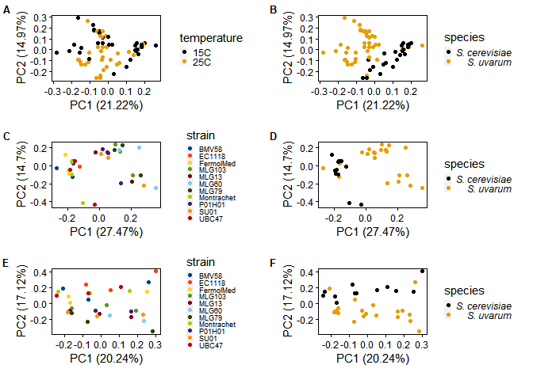
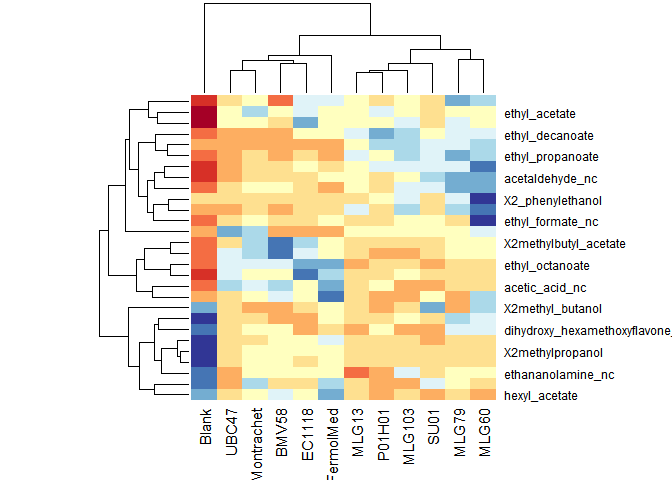

Headspace GC-MS Data Analaysis Chardonnay Fermentations
================

This analysis is for the GCMS headspace data collected at Supra. The
peak areas are from confirmed compounds with standards ran as well as
some putitativly identified peaks.

The peak areas were normalized to the TIC for each sample, therefore the
values being analyzed in this dataset are RELATIVE ABUNDANCES and NOT
absolute quantitative values.

``` r
library(readxl)
library(tigerstats)
library(tidyverse)
library(ggplot2)
library(ggpubr)
library(visreg)
library(car)
library(agricolae)
library(devtools)
library(xlsx)
library(corrplot)
library(Hmisc)
library(cowplot)
library(ggcorrplot)
library(RColorBrewer)
library(gplots)
library(ggfortify)
library(ggthemes)
```

``` r
df<-read_xlsx("revised peak areas 20200314.xlsx", sheet= "TIC_Norm_areas") %>% data.frame()
df <- filter(df, strain != "curve")
df <- filter(df, strain != "Model_Wine")
df <- filter(df, strain != "Blank")
df <- filter(df, strain != "QC")

full <- df
hot <- filter(df, temperature == "25")
cold <- filter(df, temperature =="15")
```

------------------------------------------------------------------------

Create PCA plots for the full data set colored by strain and
temperature. Blanks, QCs were removed. the plots are saved as JPEGS, and
loading plots are omitted.

``` r
# PCA
full_pcaformat <- full[6:ncol(full)] %>% data.frame()
row.names(full_pcaformat) <- full$sample_ID
full_pca <- prcomp(full_pcaformat, center = TRUE, scale. = TRUE)


#Colored by strain
strain <- full$strain
all_species_pca <- autoplot(full_pca, data = full, colour = 'species', scale = T, size = 1.25,
         loadings = FALSE, loadings.label = FALSE,loadings.label.repel=T,
         loadings.label.size = 3,loadings.colour = 'black', 
         loadings.label.colour = 'black') +
  theme(panel.background = element_blank(),
        panel.border=element_rect(fill=NA),
        panel.grid.major = element_blank(),
        panel.grid.minor = element_blank(),
        strip.background=element_blank(),
        axis.text.x=element_text(colour="black"),
        axis.text.y=element_text(colour="black"),
        axis.ticks=element_line(colour="black"),
        plot.margin=unit(c(1,1,1,1),"line"),
        legend.key.size = unit(.025, "cm"),
        legend.key.width = unit(.25,"cm"))+
  scale_color_colorblind(labels = c(expression(italic("S. cerevisiae")), expression(italic("S. uvarum")))) 
 
#ggsave("output/pca_plots/pca_full_Strainv2.jpeg")

#Colored by Temperature
#temperature <- full$temperature
all_temp_pca <- autoplot(full_pca, data = full, colour = 'temperature', scale = T, size = 1.25,
         loadings = FALSE, loadings.label = FALSE,loadings.label.repel=T,
         loadings.label.size = 3,loadings.colour = 'black', 
         loadings.label.colour = 'black') +
  theme(panel.background = element_blank(),
        panel.border=element_rect(fill=NA),
        panel.grid.major = element_blank(),
        panel.grid.minor = element_blank(),
        strip.background=element_blank(),
        axis.text.x=element_text(colour="black"),
        axis.text.y=element_text(colour="black"),
        axis.ticks=element_line(colour="black"),
        plot.margin=unit(c(1,1,1,1),"line"),
        legend.key.size = unit(.025, "cm"),
        legend.key.width = unit(.25,"cm")) +
  scale_color_colorblind(labels = c(expression("15C"), expression("25C"))) 
#ggsave("pca_full_temp.jpeg")
```

------------------------------------------------------------------------

PCA plots of 15C (cold) dataset:

``` r
cold_pcaformat <- cold[6:ncol(cold)] %>% data.frame()
row.names(cold_pcaformat) <- cold$sample_ID
cold_pca <- prcomp(cold_pcaformat, center = TRUE, scale. = TRUE)
#summary(cold_pca)
cold$strain
```

    ##  [1] "BMV58"      "BMV58"      "BMV58"      "EC1118"     "EC1118"    
    ##  [6] "EC1118"     "FermolMed"  "FermolMed"  "FermolMed"  "MLG103"    
    ## [11] "MLG103"     "MLG103"     "MLG13"      "MLG13"      "MLG13"     
    ## [16] "MLG60"      "MLG60"      "MLG60"      "MLG79"      "MLG79"     
    ## [21] "MLG79"      "Montrachet" "Montrachet" "Montrachet" "P01H01"    
    ## [26] "P01H01"     "P01H01"     "SU01"       "SU01"       "SU01"      
    ## [31] "UBC47"      "UBC47"      "UBC47"

``` r
#PCA plot of cold temp fermentations colored by strain:
strain <- cold$strain
cold_strain_pca <- autoplot(cold_pca, data = cold, colour = 'strain', scale = TRUE, size = 1.25,
         loadings = FALSE, loadings.label = FALSE,loadings.label.repel=T,
         loadings.label.size = 3,loadings.colour = 'black', 
         loadings.label.colour = 'black') +
  theme(panel.background = element_blank(),
        panel.border=element_rect(fill=NA),
        panel.grid.major = element_blank(),
        panel.grid.minor = element_blank(),
        strip.background=element_blank(),
        axis.text.x=element_text(colour="black"),
        axis.text.y=element_text(colour="black"),
        axis.ticks=element_line(colour="black"),
        plot.margin=unit(c(1,1,1,1),"line"),
        legend.key.size = unit(.025, "cm"),
        legend.key.width = unit(.25,"cm"),
        legend.text=element_text(size=6.5))+ scale_color_calc()
 


#ggsave("output/pca_plots/pca_15C_strain.jpeg")
 
#make a PCA plot of the cold dataset colored by cerevisiae or uvarum:
species <- cold$species
cold_species_pca <- autoplot(cold_pca, data = cold, colour = 'species', scale = TRUE, size = 1.25,
         loadings = FALSE, loadings.label = FALSE,loadings.label.repel=T,
         loadings.label.size = 3,loadings.colour = 'black', 
         loadings.label.colour = 'black') +
  theme(panel.background = element_blank(),
        panel.border=element_rect(fill=NA),
        panel.grid.major = element_blank(),
        panel.grid.minor = element_blank(),
        strip.background=element_blank(),
        axis.text.x=element_text(colour="black"),
        axis.text.y=element_text(colour="black"),
        axis.ticks=element_line(colour="black"),
        plot.margin=unit(c(1,1,1,1),"line"),
        legend.key.size = unit(.025, "cm"),
        legend.key.width = unit(.25,"cm")) +
  scale_color_colorblind(labels = c(expression(italic("S. cerevisiae")), expression(italic("S. uvarum")))) 

#ggsave("output/pca_plots/pca_15C_species.jpeg")
```

labels = c(expression(italic(“S. cerevisiae”)), expression(italic(“S.
uvarum”)))

------------------------------------------------------------------------

PCA plots of 25C (hot) dataset:

``` r
hot_pcaformat <- hot[6:ncol(hot)] %>% data.frame()
row.names(hot_pcaformat) <- hot$sample_ID

hot_pca <- prcomp(hot_pcaformat, center = TRUE, scale. = TRUE)
#summary(hot_pca)

#Hot df colored by strain
strain <- hot$strain
hot_strain_pca <- autoplot(hot_pca, data = hot, colour = 'strain', scale = TRUE, size = 1.25,
         loadings = FALSE, loadings.label = FALSE,loadings.label.repel=T,
         loadings.label.size = 3,loadings.colour = 'black', 
         loadings.label.colour = 'black') +
  theme(panel.background = element_blank(),
        panel.border=element_rect(fill=NA),
        panel.grid.major = element_blank(),
        panel.grid.minor = element_blank(),
        strip.background=element_blank(),
        axis.text.x=element_text(colour="black"),
        axis.text.y=element_text(colour="black"),
        axis.ticks=element_line(colour="black"),
        plot.margin=unit(c(1,1,1,1),"line"),
        legend.key.size = unit(.025, "cm"),
        legend.key.width = unit(.25,"cm"),
        legend.text=element_text(size=6.5)) + scale_color_calc()
#ggsave("output/pca_plots/pca_25C_strain.jpeg")

#make PCA plot of hot fermentations colored by strain type
species <- hot$type
hot_species_pca <-autoplot(hot_pca, data = hot, colour = 'species', scale = TRUE, size = 1.25,
         loadings = FALSE, loadings.label = FALSE,loadings.label.repel=T,
         loadings.label.size = 3,loadings.colour = 'black', 
         loadings.label.colour = 'black') +
  theme(panel.background = element_blank(),
        panel.border=element_rect(fill=NA),
        panel.grid.major = element_blank(),
        panel.grid.minor = element_blank(),
        strip.background=element_blank(),
        axis.text.x=element_text(colour="black"),
        axis.text.y=element_text(colour="black"),
        axis.ticks=element_line(colour="black"),
        plot.margin=unit(c(1,1,1,1),"line"),
        legend.key.size = unit(.025, "cm"),
        legend.key.width = unit(.25,"cm")) +
  scale_color_colorblind(labels = c(expression(italic("S. cerevisiae")), expression(italic("S. uvarum")))) 
#ggsave("output/pca_plots/pca_25C_plot_species.jpeg")
```

Arrange figures into a grid and made into a single figure.

``` r
pca_grid<-plot_grid(all_temp_pca, all_species_pca,
                    cold_strain_pca, cold_species_pca, 
                    hot_strain_pca, hot_species_pca,
                    ncol = 2, 
                    labels =c('A', 'B', 'C', 'D', 'E', 'F'),
                    label_size = 10,
                    align = "hv"
                    )
pca_grid
```

<!-- -->

``` r
#ggsave("output/pca_plots/pca_gridV4.jpeg")
```

Analyze the differences between each strain WITHIN a temperature using
an ANOVA.

- Test for homogeneity of variance - levene’s test
- ANOVA
- Post Hoc analysis - Tukey’s HSD
  \_\_\_\_\_\_\_\_\_\_\_\_\_\_\_\_\_\_\_\_\_\_\_\_\_\_\_\_\_\_\_\_\_\_\_\_\_\_\_\_\_\_\_\_\_\_\_\_\_\_\_\_\_
  25C fermentations ANOVA and Post Hoc analysis:

Levene’s test

``` r
filtered_df <- hot

#this does the test on each column of filtered_df starting at column 4
levene.results <- apply(filtered_df[,6:ncol(filtered_df)],2,function(x) {leveneTest(x~filtered_df$strain)})

#this makes a table of pvalues
levene.plvals<-lapply(levene.results,function(x) {c(x$`Pr(>F)`)}) %>% as.data.frame()
head(levene.plvals)
```

    ##   X2_phenylethanol benzalcohol dihydroxy_hexamethoxyflavone_nc hexanoic_acid
    ## 1        0.3504838   0.8692367                       0.9127007     0.6583908
    ## 2               NA          NA                              NA            NA
    ##   octanoic_acid X2_phenylethyl_acetate methionol X3_methylbutanoic_acid
    ## 1     0.5053371              0.2636742  0.572289              0.8421929
    ## 2            NA                     NA        NA                     NA
    ##   X2_methylbutanoic_acid ethyl_decanoate acetic_acid_nc ethyl_octanoate
    ## 1              0.9000252       0.9097517      0.9269626       0.5589217
    ## 2                     NA              NA             NA              NA
    ##     hexanol hexyl_acetate ethyl_hexanoate X3methyl_butanol X2methyl_butanol
    ## 1 0.9264639     0.4911678       0.4183172        0.9803465         0.782882
    ## 2        NA            NA              NA               NA               NA
    ##   X2methylbutyl_acetate X2methylpropanol ethyl_3_methyl_butanoate
    ## 1             0.6942917        0.9998128                0.9999999
    ## 2                    NA               NA                       NA
    ##   ethyl_2_methyl_butanoate ethyl_butanoate ethyl_2_methyl_propanoate
    ## 1                        1       0.9791214                 0.9996137
    ## 2                       NA              NA                        NA
    ##   ethyl_propanoate ethyl_acetate ethyl_formate_nc acetaldehyde_nc
    ## 1        0.9849433     0.9588228        0.9712495       0.2733037
    ## 2               NA            NA               NA              NA
    ##   ethananolamine_nc   ethanol  glycerol   glucose fructose
    ## 1         0.8553359 0.8913866 0.9421553 0.9154847 0.993634
    ## 2                NA        NA        NA        NA       NA

``` r
#Make an excel file for all the hot temp anova related results. 
#write.xlsx(levene.plvals, file="output/Spreadsheets/25C_output_res.xlsx", sheetName="LevenesTest", row.names=TRUE)
```

ANOVA

``` r
#define df I am analyzing 
x<-hot

#now create an empty df
anova.out <- data.frame(ss_trt = rep(NA, 33), ss_error = rep(NA, 33), f_val = rep(NA, 33), p_val = rep(NA, 33), stringsAsFactors = FALSE)

row.names(anova.out) <- colnames(x[,5:ncol(x)])

#Create the for loop (compound ~ yeast strain) within in a single trt
for (i in 6:ncol(x)) {
lm.res<-lm(x[[i]]~ x$strain)
anova.res<-anova(lm.res)
anova.out$ss_trt[i-5] <- anova.res$`Sum Sq`[2]
anova.out$ss_error[i-5] <- anova.res$`Sum Sq`[1]
anova.out$f_val[i-5] <- anova.res$`F value`[1]
anova.out$p_val[i-5] <- anova.res$`Pr(>F)`[1]
}
anova.out  
```

    ##                                       ss_trt     ss_error       f_val
    ## species                         1.040640e+11 2.569803e+11  5.43277611
    ## X2_phenylethanol                1.281740e+05 6.962613e+04  1.19507451
    ## benzalcohol                     4.199393e+07 1.365118e+07  0.71516528
    ## dihydroxy_hexamethoxyflavone_nc 4.144051e+07 1.500318e+07  0.79649099
    ## hexanoic_acid                   2.279099e+05 1.555253e+05  1.50127642
    ## octanoic_acid                   1.333719e+08 2.830241e+09 46.68547482
    ## X2_phenylethyl_acetate          1.049572e+07 4.741278e+06  0.99381593
    ## methionol                       6.274871e+06 8.336840e+06  2.92293594
    ## X3_methylbutanoic_acid          1.514630e+06 4.090349e+06  5.94122988
    ## X2_methylbutanoic_acid          2.523757e+09 4.338562e+09  3.78199595
    ## ethyl_decanoate                 1.702185e+10 2.931922e+10  3.78938097
    ## acetic_acid_nc                  3.026328e+10 5.920360e+10  4.30382639
    ## ethyl_octanoate                 6.049394e+05 2.363148e+05  0.85941257
    ## hexanol                         2.309638e+05 7.669476e+04  0.73054081
    ## hexyl_acetate                   7.754570e+09 1.770833e+10  5.02391848
    ## ethyl_hexanoate                 3.572141e+12 9.933839e+11  0.61180239
    ## X3methyl_butanol                1.607243e+05 5.781344e+04  0.79135226
    ## X2methyl_butanol                8.092230e+06 1.479832e+07  4.02315605
    ## X2methylbutyl_acetate           2.984200e+10 7.522101e+09  0.55454130
    ## X2methylpropanol                1.652444e+10 2.321363e+08  0.03090574
    ## ethyl_3_methyl_butanoate        4.319204e+07 3.507669e+06  0.17866421
    ## ethyl_2_methyl_butanoate        5.416703e+08 3.031628e+08  1.23129940
    ## ethyl_butanoate                 3.670128e+10 1.297051e+09  0.07774967
    ## ethyl_2_methyl_propanoate       3.462979e+09 3.401066e+09  2.16066734
    ## ethyl_propanoate                1.154399e+13 5.116514e+12  0.97508138
    ## ethyl_acetate                   1.736613e+08 1.110106e+08  1.40632029
    ## ethyl_formate_nc                1.588098e+12 1.159843e+12  1.60673596
    ## acetaldehyde_nc                 5.663806e+13 2.563823e+13  0.99586909
    ## ethananolamine_nc               8.469199e+03 2.422014e+03  0.62915397
    ## ethanol                         3.572736e+01 3.604703e+01  2.21968472
    ## glycerol                        2.940635e+02 1.934905e+02  1.44757552
    ## glucose                         7.809754e+03 2.670477e+03  0.75227070
    ## fructose                                  NA           NA          NA
    ##                                        p_val
    ## species                         4.588857e-04
    ## X2_phenylethanol                3.458934e-01
    ## benzalcohol                     7.018240e-01
    ## dihydroxy_hexamethoxyflavone_nc 6.333366e-01
    ## hexanoic_acid                   2.044821e-01
    ## octanoic_acid                   1.768700e-12
    ## X2_phenylethyl_acetate          4.773746e-01
    ## methionol                       1.721925e-02
    ## X3_methylbutanoic_acid          2.464683e-04
    ## X2_methylbutanoic_acid          4.437198e-03
    ## ethyl_decanoate                 4.388189e-03
    ## acetic_acid_nc                  2.069886e-03
    ## ethyl_octanoate                 5.814169e-01
    ## hexanol                         6.888442e-01
    ## hexyl_acetate                   7.752510e-04
    ## ethyl_hexanoate                 7.875679e-01
    ## X3methyl_butanol                6.376349e-01
    ## X2methyl_butanol                3.102044e-03
    ## X2methylbutyl_acetate           8.323473e-01
    ## X2methylpropanol                9.999986e-01
    ## ethyl_3_methyl_butanoate        9.962161e-01
    ## ethyl_2_methyl_butanoate        3.256005e-01
    ## ethyl_butanoate                 9.998956e-01
    ## ethyl_2_methyl_propanoate       6.348079e-02
    ## ethyl_propanoate                4.911795e-01
    ## ethyl_acetate                   2.413901e-01
    ## ethyl_formate_nc                1.697589e-01
    ## acetaldehyde_nc                 4.758769e-01
    ## ethananolamine_nc               7.735005e-01
    ## ethanol                         5.722088e-02
    ## glycerol                        2.246529e-01
    ## glucose                         6.704986e-01
    ## fructose                                  NA

``` r
#Write the results to an excel file inside a folder for this analysis. 
#write.xlsx(anova.out, file="output/Spreadsheets/25C_output_res.xlsx", sheetName="ANOVA_results", append = TRUE, row.names=TRUE)
```

For the post hoc analysis I will use a Tukey’s HSD test and generate
letter codes to indicate significance. Strains that share the same
letter are not significantly different.

``` r
#Making a loop that will output the results into a df. 
x <- hot
#Make and empty df to fill
hsd_df.out <-data.frame(X2_phenylethanol = rep(NA, 11),
                        benzalcohol = rep(NA, 11), 
                        dihydroxy_hexamethoxyflavone_putative = rep(NA, 11), 
                        hexanoic_acid = rep(NA, 11),
                        octanoic_acid = rep(NA, 11),
                        X2_phenylethyl_acetate = rep(NA, 11),
                        methionol = rep(NA, 11),
                        X3_methylbutanoic_acid = rep(NA, 11),
                        X2.methylbutanoic_acid = rep(NA, 11),
                        ethyl_decanoate = rep(NA, 11),
                        acetic_acid_putative = rep(NA, 11),
                        ethyl_octanoate = rep(NA, 11),
                        hexanol = rep(NA, 11), 
                        hexyl_acetate = rep(NA, 11),
                        ethyl_hexanoate = rep(NA, 11),
                        X3methyl_butanol = rep(NA, 11),
                        X2methyl_butanol = rep(NA, 11),
                        X2methylbutyl_acetate = rep(NA, 11),
                        X2methylpropanol = rep(NA, 11),
                        ethyl_3_methyl_butanoate = rep(NA, 11),
                        ethyl_2_methyl_butanoate = rep(NA, 11),
                        ethyl_butanoate = rep(NA, 11),
                        ethyl_2_methyl_propanoate = rep(NA, 11),
                        ethyl_propanoate = rep(NA, 11),
                        ethyl_acetate = rep(NA, 11),
                        ethyl_formate_putative = rep(NA, 11),
                        acetaldehyde_putative = rep(NA, 11),
                        ethananolamine_putative = rep(NA, 11),
                        ethanol= rep(NA, 11),
                        glycerol= rep(NA, 11),
                        glucose= rep(NA, 11),
                        fructose= rep(NA, 11),
                        aucl = rep(NA, 11),
                        stringsAsFactors = FALSE) 
row.names(hsd_df.out) <- sort(unique(x$strain))

for (i in 6:ncol(x)) {
model <- aov(x[[i]]~strain, data = x)  
hsd_res <- HSD.test(model, "strain", group = TRUE)
groups <- data.frame(hsd_res$groups)
groups <- groups[order(row.names(groups)),]
hsd_df.out[,i-5] <- groups$groups
}
hsd_df.out
```

    ##            X2_phenylethanol benzalcohol dihydroxy_hexamethoxyflavone_putative
    ## BMV58                     c           a                                     a
    ## EC1118                    c           a                                     a
    ## FermolMed                 c           a                                     a
    ## MLG103                   bc           a                                     a
    ## MLG13                   abc           a                                     a
    ## MLG60                    ab           a                                     a
    ## MLG79                     a           a                                     a
    ## Montrachet                c           a                                     a
    ## P01H01                  abc           a                                     a
    ## SU01                    abc           a                                     a
    ## UBC47                     c           a                                     a
    ##            hexanoic_acid octanoic_acid X2_phenylethyl_acetate methionol
    ## BMV58                  a             a                      c         a
    ## EC1118                 a             a                      c         a
    ## FermolMed              a             a                      c         a
    ## MLG103                 a             a                      a         a
    ## MLG13                  a             a                      b         a
    ## MLG60                  a             a                      a         a
    ## MLG79                  a             a                      a         a
    ## Montrachet             a             a                      c         a
    ## P01H01                 a             a                     ab         a
    ## SU01                   a             a                     ab         a
    ## UBC47                  a             a                      c         a
    ##            X3_methylbutanoic_acid X2.methylbutanoic_acid ethyl_decanoate
    ## BMV58                           a                      c               a
    ## EC1118                          a                      c               a
    ## FermolMed                       a                     bc               a
    ## MLG103                          a                    abc               a
    ## MLG13                           a                     ab               a
    ## MLG60                           a                    abc               a
    ## MLG79                           a                      a               a
    ## Montrachet                      a                      c               a
    ## P01H01                          a                    abc               a
    ## SU01                            a                    abc               a
    ## UBC47                           a                      c               a
    ##            acetic_acid_putative ethyl_octanoate hexanol hexyl_acetate
    ## BMV58                         a               b       a             a
    ## EC1118                       ab               a       a             a
    ## FermolMed                    ab              ab       a             a
    ## MLG103                        b               b       a             a
    ## MLG13                        ab               b       a             a
    ## MLG60                         b               b       a             a
    ## MLG79                        ab               b       a             a
    ## Montrachet                   ab               b       a             a
    ## P01H01                       ab               b       a             a
    ## SU01                         ab               b       a             a
    ## UBC47                         a               b       a             a
    ##            ethyl_hexanoate X3methyl_butanol X2methyl_butanol
    ## BMV58                    b                a                a
    ## EC1118                   a                a                a
    ## FermolMed                b                a                a
    ## MLG103                   b                a                a
    ## MLG13                    b                a                a
    ## MLG60                    b                a                a
    ## MLG79                    b                a                a
    ## Montrachet               b                a                a
    ## P01H01                   b                a                a
    ## SU01                     b                a                a
    ## UBC47                    b                a                a
    ##            X2methylbutyl_acetate X2methylpropanol ethyl_3_methyl_butanoate
    ## BMV58                          a                a                        a
    ## EC1118                        ab                a                        a
    ## FermolMed                     ab                a                        a
    ## MLG103                         b                a                        a
    ## MLG13                          b                a                        a
    ## MLG60                          b                a                        a
    ## MLG79                          b                a                        a
    ## Montrachet                    ab                a                        a
    ## P01H01                         b                a                        a
    ## SU01                           b                a                        a
    ## UBC47                          b                a                        a
    ##            ethyl_2_methyl_butanoate ethyl_butanoate ethyl_2_methyl_propanoate
    ## BMV58                             a               a                         a
    ## EC1118                            a               a                         a
    ## FermolMed                         a               a                         a
    ## MLG103                            a               a                         a
    ## MLG13                             a               a                         a
    ## MLG60                             a               a                         a
    ## MLG79                             a               a                         a
    ## Montrachet                        a               a                         a
    ## P01H01                            a               a                         a
    ## SU01                              a               a                         a
    ## UBC47                             a               a                         a
    ##            ethyl_propanoate ethyl_acetate ethyl_formate_putative
    ## BMV58                     a             a                      a
    ## EC1118                    a             a                      a
    ## FermolMed                 a             a                      a
    ## MLG103                    a             a                      a
    ## MLG13                     a             a                      a
    ## MLG60                     a             a                      a
    ## MLG79                     a             a                      a
    ## Montrachet                a             a                      a
    ## P01H01                    a             a                      a
    ## SU01                      a             a                      a
    ## UBC47                     a             a                      a
    ##            acetaldehyde_putative ethananolamine_putative ethanol glycerol
    ## BMV58                          a                       a       a        a
    ## EC1118                         a                       a       a        a
    ## FermolMed                      a                       a       a        a
    ## MLG103                         a                       a       a        a
    ## MLG13                          a                       a       a        a
    ## MLG60                          a                       a       a        a
    ## MLG79                          a                       a       a        a
    ## Montrachet                     a                       a       a        a
    ## P01H01                         a                       a       a        a
    ## SU01                           a                       a       a        a
    ## UBC47                          a                       a       a        a
    ##            glucose fructose aucl
    ## BMV58            a        a   NA
    ## EC1118           a        a   NA
    ## FermolMed        a        a   NA
    ## MLG103           a        a   NA
    ## MLG13            a        a   NA
    ## MLG60            a        a   NA
    ## MLG79            a        a   NA
    ## Montrachet       a        a   NA
    ## P01H01           a        a   NA
    ## SU01             a        a   NA
    ## UBC47            a        a   NA

``` r
#Save the output into the anova results file:
#write.xlsx(hsd_df.out, file="output/Spreadsheets/25C_output_res.xlsx", sheetName="HSD_PostHoc_results", append = TRUE, row.names=TRUE)
```

------------------------------------------------------------------------

15C fermentation ANOVA and post hoc analysis:

Levene’s test

``` r
filtered_df <- cold

#this does the test on each column of filtered_df starting at column 4
levene.results <- apply(filtered_df[,6:ncol(filtered_df)],2,function(x) {leveneTest(x~filtered_df$strain)})

#this makes a table of pvalues
levene.plvals<-lapply(levene.results,function(x) {c(x$`Pr(>F)`)}) %>% as.data.frame()
levene.plvals
```

    ##   X2_phenylethanol benzalcohol dihydroxy_hexamethoxyflavone_nc hexanoic_acid
    ## 1        0.1077699   0.9620867                        0.797345     0.6446222
    ## 2               NA          NA                              NA            NA
    ##   octanoic_acid X2_phenylethyl_acetate methionol X3_methylbutanoic_acid
    ## 1     0.7010821              0.5063799 0.5958336              0.5355968
    ## 2            NA                     NA        NA                     NA
    ##   X2_methylbutanoic_acid ethyl_decanoate acetic_acid_nc ethyl_octanoate
    ## 1              0.8532171       0.9770219      0.7926308       0.7239113
    ## 2                     NA              NA             NA              NA
    ##     hexanol hexyl_acetate ethyl_hexanoate X3methyl_butanol X2methyl_butanol
    ## 1 0.8429569      0.588553       0.6467075        0.8057081        0.5770868
    ## 2        NA            NA              NA               NA               NA
    ##   X2methylbutyl_acetate X2methylpropanol ethyl_3_methyl_butanoate
    ## 1             0.6622405         0.853647                0.9623623
    ## 2                    NA               NA                       NA
    ##   ethyl_2_methyl_butanoate ethyl_butanoate ethyl_2_methyl_propanoate
    ## 1                0.9654065       0.7015356                 0.8943255
    ## 2                       NA              NA                        NA
    ##   ethyl_propanoate ethyl_acetate ethyl_formate_nc acetaldehyde_nc
    ## 1        0.4099449     0.8265743        0.6033946       0.7808777
    ## 2               NA            NA               NA              NA
    ##   ethananolamine_nc   ethanol  glycerol   glucose  fructose
    ## 1         0.6971006 0.8953764 0.3451965 0.6614684 0.9998498
    ## 2                NA        NA        NA        NA        NA

``` r
#Write an excel file that will keep all of our anova results from cold fermentation analysis:
#write.xlsx(levene.plvals, file="output/Spreadsheets/15C_output_res.xlsx", sheetName="LevenesTest", row.names=TRUE)
```

ANOVA for 15C (cold) fermentations

``` r
#define df I am analyzing as x so that I dont have to change all the code for cold fermentaitons
x<-cold
#now create an empty df
anova.out <- data.frame(ss_trt = rep(NA, 33), ss_error = rep(NA, 33), f_val = rep(NA, 33), p_val = rep(NA, 33), stringsAsFactors = FALSE)
row.names(anova.out) <- colnames(x[,5:ncol(x)])
#Create the for loop (compound ~ yeast strain) within in a single trt
for (i in 6:ncol(x)) {
lm.res<-lm(x[[i]]~ x$strain)
anova.res<-anova(lm.res)
anova.out$ss_trt[i-5] <- anova.res$`Sum Sq`[2]
anova.out$ss_error[i-5] <- anova.res$`Sum Sq`[1]
anova.out$f_val[i-5] <- anova.res$`F value`[1]
anova.out$p_val[i-5] <- anova.res$`Pr(>F)`[1]
}
anova.out  
```

    ##                                       ss_trt     ss_error       f_val
    ## species                         1.252838e+11 3.774420e+11   6.6279289
    ## X2_phenylethanol                7.468693e+04 1.212905e+05   3.5727697
    ## benzalcohol                     5.817456e+07 1.022219e+07   0.3865747
    ## dihydroxy_hexamethoxyflavone_nc 1.866671e+08 1.220999e+08   1.4390307
    ## hexanoic_acid                   4.650374e+05 2.460618e+05   1.1640699
    ## octanoic_acid                   3.907723e+07 3.406896e+09 191.8040183
    ## X2_phenylethyl_acetate          5.698923e+06 1.771171e+07   6.8373916
    ## methionol                       3.855335e+07 5.012522e+07   2.8603341
    ## X3_methylbutanoic_acid          3.211460e+06 5.113154e+06   3.5027489
    ## X2_methylbutanoic_acid          1.546511e+09 7.713858e+09  10.9734057
    ## ethyl_decanoate                 3.984032e+09 2.617270e+10  14.4526781
    ## acetic_acid_nc                  1.209444e+10 1.726768e+11  31.4102198
    ## ethyl_octanoate                 4.851681e+05 1.495703e+05   0.6782282
    ## hexanol                         2.124194e+05 8.893516e+04   0.9210899
    ## hexyl_acetate                   4.747801e+09 3.739595e+10  17.3282513
    ## ethyl_hexanoate                 7.496035e+12 2.800168e+12   0.8218171
    ## X3methyl_butanol                2.837787e+06 1.104131e+06   0.8559795
    ## X2methyl_butanol                3.066946e+06 4.118367e+07  29.5421131
    ## X2methylbutyl_acetate           1.863658e+10 6.725799e+09   0.7939632
    ## X2methylpropanol                1.193463e+10 2.167907e+09   0.3996266
    ## ethyl_3_methyl_butanoate        2.835933e+07 6.007098e+06   0.4660060
    ## ethyl_2_methyl_butanoate        2.181883e+08 4.942472e+08   4.9835105
    ## ethyl_butanoate                 2.157202e+10 4.387765e+09   0.4474817
    ## ethyl_2_methyl_propanoate       2.292897e+09 7.297897e+09   7.0022232
    ## ethyl_propanoate                6.961518e+12 4.045627e+12   1.2785111
    ## ethyl_acetate                   3.522450e+08 1.942832e+08   1.2134254
    ## ethyl_formate_nc                2.626819e+11 1.527993e+12  12.7971679
    ## acetaldehyde_nc                 1.694675e+14 4.242444e+13   0.5507474
    ## ethananolamine_nc               5.092912e+03 1.330353e+03   0.5746765
    ## ethanol                         8.703113e+01 8.349696e+01   2.1106623
    ## glycerol                        1.245401e+02 1.587718e+02   2.8047031
    ## glucose                         4.695769e+03 2.132860e+03   0.9992596
    ## fructose                                  NA           NA          NA
    ##                                        p_val
    ## species                         1.118012e-04
    ## X2_phenylethanol                6.101569e-03
    ## benzalcohol                     9.391080e-01
    ## dihydroxy_hexamethoxyflavone_nc 2.280288e-01
    ## hexanoic_acid                   3.640786e-01
    ## octanoic_acid                   5.220520e-19
    ## X2_phenylethyl_acetate          8.875698e-05
    ## methionol                       1.910224e-02
    ## X3_methylbutanoic_acid          6.799314e-03
    ## X2_methylbutanoic_acid          1.981822e-06
    ## ethyl_decanoate                 1.744061e-07
    ## acetic_acid_nc                  1.007350e-10
    ## ethyl_octanoate                 7.328845e-01
    ## hexanol                         5.322978e-01
    ## hexyl_acetate                   3.276254e-08
    ## ethyl_hexanoate                 6.122645e-01
    ## X3methyl_butanol                5.842086e-01
    ## X2methyl_butanol                1.861412e-10
    ## X2methylbutyl_acetate           6.354501e-01
    ## X2methylpropanol                9.325656e-01
    ## ethyl_3_methyl_butanoate        8.942853e-01
    ## ethyl_2_methyl_butanoate        8.175152e-04
    ## ethyl_butanoate                 9.057656e-01
    ## ethyl_2_methyl_propanoate       7.425075e-05
    ## ethyl_propanoate                3.006703e-01
    ## ethyl_acetate                   3.354857e-01
    ## ethyl_formate_nc                5.191045e-07
    ## acetaldehyde_nc                 8.352051e-01
    ## ethananolamine_nc               8.169332e-01
    ## ethanol                         6.933648e-02
    ## glycerol                        2.095919e-02
    ## glucose                         4.734103e-01
    ## fructose                                  NA

``` r
#Write the results to an excel file inside a folder for this analysis. 
#write.xlsx(anova.out, file="output/Spreadsheets/15C_output_res.xlsx", sheetName="ANOVA_results", append = TRUE, row.names=TRUE)
```

For the post hoc analysis I will use a Tukey’s HSD test and generate
letter codes to indicate significance. Strains that share the same
letter are not significantly different.

``` r
#Making a loop that will output the results into a df. 
x <- cold
#Make and empty df to fill
hsd_df.out <-data.frame(X2_phenylethanol = rep(NA, 11),
                        benzalcohol = rep(NA, 11), 
                        dihydroxy_hexamethoxyflavone_putative = rep(NA, 11), 
                        hexanoic_acid = rep(NA, 11),
                        octanoic_acid = rep(NA, 11),
                        X2_phenylethyl_acetate = rep(NA, 11),
                        methionol = rep(NA, 11),
                        X3_methylbutanoic_acid = rep(NA, 11),
                        X2.methylbutanoic_acid = rep(NA, 11),
                        ethyl_decanoate = rep(NA, 11),
                        acetic_acid_putative = rep(NA, 11),
                        ethyl_octanoate = rep(NA, 11),
                        hexanol = rep(NA, 11), 
                        hexyl_acetate = rep(NA, 11),
                        ethyl_hexanoate = rep(NA, 11),
                        X3methyl_butanol = rep(NA, 11),
                        X2methyl_butanol = rep(NA, 11),
                        X2methylbutyl_acetate = rep(NA, 11),
                        X2methylpropanol = rep(NA, 11),
                        ethyl_3_methyl_butanoate = rep(NA, 11),
                        ethyl_2_methyl_butanoate = rep(NA, 11),
                        ethyl_butanoate = rep(NA, 11),
                        ethyl_2_methyl_propanoate = rep(NA, 11),
                        ethyl_propanoate = rep(NA, 11),
                        ethyl_acetate = rep(NA, 11),
                        ethyl_formate_putative = rep(NA, 11),
                        acetaldehyde_putative = rep(NA, 11),
                        ethananolamine_putative = rep(NA, 11),
                        ethanol= rep(NA, 11),
                        glycerol= rep(NA, 11),
                        glucose= rep(NA, 11),
                        fructose= rep(NA, 11),
                        aucl = rep(NA, 11),
                        stringsAsFactors = FALSE) 
row.names(hsd_df.out) <- sort(unique(x$strain))

for (i in 6:ncol(x)) {
model <- aov(x[[i]]~strain, data = x)  
hsd_res <- HSD.test(model, "strain", group = TRUE)
groups <- data.frame(hsd_res$groups)
groups <- groups[order(row.names(groups)),]
hsd_df.out[,i-5] <- groups$groups
}
hsd_df.out
```

    ##            X2_phenylethanol benzalcohol dihydroxy_hexamethoxyflavone_putative
    ## BMV58                     b           b                                     a
    ## EC1118                    b           b                                     a
    ## FermolMed                 b          ab                                     a
    ## MLG103                   ab          ab                                     a
    ## MLG13                     b          ab                                     a
    ## MLG60                     a          ab                                     a
    ## MLG79                     b           a                                     a
    ## Montrachet                b          ab                                     a
    ## P01H01                    b          ab                                     a
    ## SU01                      b           b                                     a
    ## UBC47                     b          ab                                     a
    ##            hexanoic_acid octanoic_acid X2_phenylethyl_acetate methionol
    ## BMV58                  a             a                      d         c
    ## EC1118                 a             a                      d         c
    ## FermolMed              a             a                      d        bc
    ## MLG103                 a             a                      a        ab
    ## MLG13                  a             a                      c       abc
    ## MLG60                  a             a                      a         a
    ## MLG79                  a             a                      b       abc
    ## Montrachet             a             a                      d         c
    ## P01H01                 a             a                      a        bc
    ## SU01                   a             a                     bc        bc
    ## UBC47                  a             a                      d         c
    ##            X3_methylbutanoic_acid X2.methylbutanoic_acid ethyl_decanoate
    ## BMV58                           a                    abc              de
    ## EC1118                         ab                    abc            bcde
    ## FermolMed                      ab                      c             abc
    ## MLG103                          b                    abc              ab
    ## MLG13                          ab                    abc             abc
    ## MLG60                          ab                     ab              ab
    ## MLG79                          ab                      a              ab
    ## Montrachet                     ab                    abc               e
    ## P01H01                          b                     bc               a
    ## SU01                           ab                    abc             bcd
    ## UBC47                          ab                     bc             cde
    ##            acetic_acid_putative ethyl_octanoate hexanol hexyl_acetate
    ## BMV58                         a              bc       a             a
    ## EC1118                      bcd               a       a             a
    ## FermolMed                     a               a       a             a
    ## MLG103                        d              cd       a             a
    ## MLG13                        cd               d       a             a
    ## MLG60                       bcd               d       a             a
    ## MLG79                         d               d       a             a
    ## Montrachet                  abc               b       a             a
    ## P01H01                      bcd              cd       a             a
    ## SU01                          d               d       a             a
    ## UBC47                        ab               b       a             a
    ##            ethyl_hexanoate X3methyl_butanol X2methyl_butanol
    ## BMV58                  bcd                a                a
    ## EC1118                   a                a                a
    ## FermolMed                b                a                a
    ## MLG103                  cd                a                a
    ## MLG13                   cd                a                a
    ## MLG60                   cd                a                a
    ## MLG79                   cd                a                a
    ## Montrachet              bc                a                a
    ## P01H01                  cd                a                a
    ## SU01                     d                a                a
    ## UBC47                   bc                a                a
    ##            X2methylbutyl_acetate X2methylpropanol ethyl_3_methyl_butanoate
    ## BMV58                          a                a                        a
    ## EC1118                         b                a                        a
    ## FermolMed                      c                a                        a
    ## MLG103                         c                a                        a
    ## MLG13                          c                a                        a
    ## MLG60                          c                a                        a
    ## MLG79                          c                a                        a
    ## Montrachet                     b                a                        a
    ## P01H01                         c                a                        a
    ## SU01                           c                a                        a
    ## UBC47                          c                a                        a
    ##            ethyl_2_methyl_butanoate ethyl_butanoate ethyl_2_methyl_propanoate
    ## BMV58                             a               b                         a
    ## EC1118                            a               a                         a
    ## FermolMed                         a               b                         a
    ## MLG103                            a              ab                         a
    ## MLG13                             a               b                         a
    ## MLG60                             a               b                         a
    ## MLG79                             a              ab                         a
    ## Montrachet                        a               b                         a
    ## P01H01                            a               b                         a
    ## SU01                              a               b                         a
    ## UBC47                             a               b                         a
    ##            ethyl_propanoate ethyl_acetate ethyl_formate_putative
    ## BMV58                     d             a                      a
    ## EC1118                  bcd             a                      a
    ## FermolMed                cd             a                      a
    ## MLG103                  abc             a                      a
    ## MLG13                  abcd             a                      a
    ## MLG60                    ab             a                      a
    ## MLG79                     a             a                      a
    ## Montrachet              bcd             a                      a
    ## P01H01                 abcd             a                      a
    ## SU01                   abcd             a                      a
    ## UBC47                     d             a                      a
    ##            acetaldehyde_putative ethananolamine_putative ethanol glycerol
    ## BMV58                          c                       a       a        a
    ## EC1118                         c                       a       a        a
    ## FermolMed                     bc                       a       a        a
    ## MLG103                        bc                       a       a        a
    ## MLG13                         bc                       a       a        a
    ## MLG60                          a                       a       a        a
    ## MLG79                          a                       a       a        a
    ## Montrachet                     c                       a       a        a
    ## P01H01                         c                       a       a        a
    ## SU01                          ab                       a       a        a
    ## UBC47                          c                       a       a        a
    ##            glucose fructose aucl
    ## BMV58           ab        a   NA
    ## EC1118           b        a   NA
    ## FermolMed       ab        a   NA
    ## MLG103          ab        a   NA
    ## MLG13           ab        a   NA
    ## MLG60           ab        a   NA
    ## MLG79           ab        a   NA
    ## Montrachet       a        a   NA
    ## P01H01          ab        a   NA
    ## SU01            ab        a   NA
    ## UBC47           ab        a   NA

``` r
#write output to the excel file
#write.xlsx(hsd_df.out, file="output/Spreadsheets/15C_output_res.xlsx", sheetName="HSD_PostHoc_results", append = TRUE, row.names=TRUE)
```

------------------------------------------------------------------------

------------------------------------------------------------------------

Heatmaps

``` r
library(RColorBrewer)
#library(ComplexHeatmap)
```

``` r
suppressWarnings({
#15C all compounds averaged 
cold_averages<-read_xlsx("15C.xlsx", sheet= "averages_for_correlation") %>% data.frame()
rnames<- cold_averages$strain
cold_averages <- cold_averages[2:ncol(cold_averages)]
row.names(cold_averages) <- rnames
cold_averages <- as.matrix(cold_averages)

#25C all compounds averaged
hot_averages<-read_xlsx("25C.xlsx", sheet= "averages_for_correlation") %>% data.frame()
rnames<- hot_averages$strain
hot_averages <- hot_averages[2:ncol(hot_averages)]
row.names(hot_averages) <- rnames
hot_averages <- as.matrix(hot_averages)

#Sclaed by column,since we need to absorb the variation between column.
trans<- t(as.matrix(hot_averages))

trans<- t(as.matrix(cold_averages))

x <- trans
rm <- rowMeans(x)
x             <- sweep(x, 1, rm)
sx            <- apply(x, 1, sd)
x             <- sweep(x, 1, sx, "/")


heatmap(x, name = "x", 
        col = brewer.pal(11,"RdYlBu"),
        cluster_rows = FALSE, cluster_columns = FALSE,
        row_split = rep(c("A", "B", "C", 
                          "D", "E" ), 
                        c(4,5,7,8,4)),
        cluster_row_slices = FALSE, cluster_column_slices = FALSE)
})
```

<!-- -->
